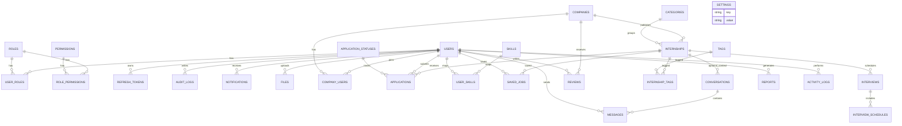

# ERD

```mermaid
erDiagram
    USERS ||--o{ USER_ROLES : has
    ROLES ||--o{ USER_ROLES : has
    ROLES ||--o{ ROLE_PERMISSIONS : has
    PERMISSIONS ||--o{ ROLE_PERMISSIONS : has
    USERS ||--o{ REFRESH_TOKENS : owns
    USERS ||--o{ AUDIT_LOGS : writes
    USERS ||--o{ NOTIFICATIONS : receives
    USERS ||--o{ FILES : uploads
    USERS ||--o{ COMPANY_USERS : joins
    COMPANIES ||--o{ COMPANY_USERS : has
    COMPANIES ||--o{ INTERNSHIPS : publishes
    CATEGORIES ||--o{ INTERNSHIPS : groups
    INTERNSHIPS ||--o{ APPLICATIONS : receives
    USERS ||--o{ APPLICATIONS : submits
    APPLICATION_STATUSES ||--o{ APPLICATIONS : tracks
    SKILLS ||--o{ USER_SKILLS : maps
    USERS ||--o{ USER_SKILLS : maps
    INTERNSHIPS ||--o{ SAVED_JOBS : saved
    USERS ||--o{ SAVED_JOBS : saves
    CONVERSATIONS ||--o{ MESSAGES : contains
    INTERNSHIPS ||--o{ CONVERSATIONS : optional_context
    USERS ||--o{ MESSAGES : sends
    COMPANIES ||--o{ REVIEWS : receives
    USERS ||--o{ REVIEWS : writes
    INTERNSHIPS ||--o{ INTERNSHIP_TAGS : tagged
    TAGS ||--o{ INTERNSHIP_TAGS : tagged
    INTERNSHIPS ||--o{ INTERVIEWS : schedules
    INTERVIEWS ||--o{ INTERVIEW_SCHEDULES : includes
    USERS ||--o{ REPORTS : generates
    USERS ||--o{ ACTIVITY_LOGS : performs
    SETTINGS {
        string key
        string value
    }
```

The CMS uses `Settings` rows with a `cms:` prefix, so public content stays separate from business entities.
